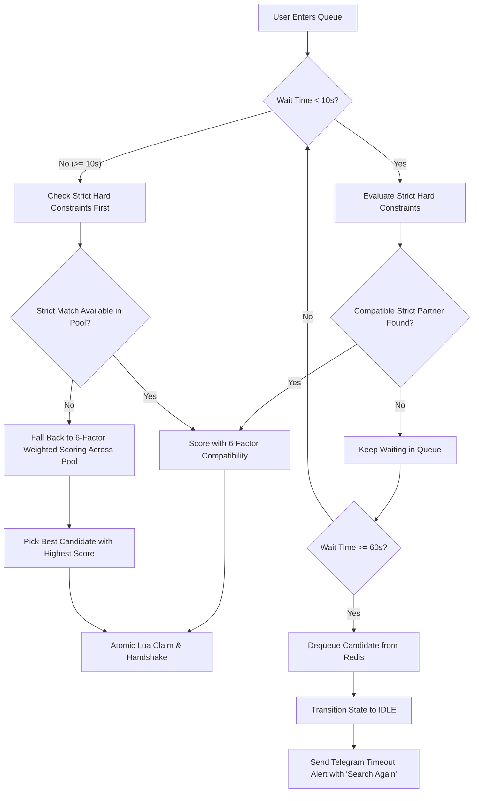

# Matchmaking Degradation & Strict Queue Timeout

## 1. Overview & Problem Solved
In matchmaking bots, strict filters (gender, age bracket, and language) can cause users to wait indefinitely if there are few waiting candidates with identical demographics. 

To eliminate infinite waiting while maintaining search preferences:
1. **First 10 Seconds (Strict Filtering)**: The engine searches exclusively for candidates who satisfy mutual hard constraints (demographics: gender, age, language).
2. **After 10 Seconds (Graceful Degradation to Weighted Scoring)**: If no hard-constraint match is found within 10 seconds, demographic constraints relax and the engine falls back to the **6-factor weighted compatibility scoring** model to pair with the best available candidate in the pool.
3. **Strict 1-Minute Queue Timeout (60 Seconds)**: A user will **never wait longer than 1 minute** in the matchmaking queue. If no compatible partner is found within 60 seconds, the user is safely dequeued, returned to `IDLE` state, and sent a polite Telegram notification with a **🔄 Search Again** button.

---

## 2. Matchmaking Priority Pipeline



---

## 3. Strict Invariants (Never Relaxed)

| Rule | Policy | Relaxation Window |
|---|---|---|
| **Self-Matching** | Users can never match with themselves (`cand_a.id != cand_b.id`). | **NEVER** |
| **Mutual Blocklist** | Users who blocked each other via `/block` are **never** matched (checked via Redis `user:blocks:{id}`). | **NEVER** |
| **Gender Preference** | Strictly enforced for the first 10s. | Relaxed to weighted scoring after 10s. |
| **Age Range** | Strictly enforced for the first 10s. | Relaxed to weighted scoring after 10s. |
| **Language Preference** | Strictly enforced for the first 10s. | Relaxed to weighted scoring after 10s. |
| **Maximum Queue Time** | Strictly capped at 60 seconds (1 minute). | Dequeued & notified at 60.0s. |

---

## 4. Configuration

All thresholds are centrally configurable in `app/config/settings.py` or via environment variables:

```python
# Matchmaking & Queue Configuration
MATCHMAKING_HARD_CONSTRAINT_TIMEOUT_SECONDS: float = 10.0  # Dynamic relaxation threshold
MATCHMAKING_MAX_QUEUE_WAIT_SECONDS: float = 60.0           # Strict 1-minute queue timeout
```

In `MatchmakingConfig` (`app/core/matching/engine.py`):
```python
class MatchmakingConfig:
    WEIGHT_LANGUAGE: float = 0.30
    WEIGHT_INTERESTS: float = 0.25
    WEIGHT_LOCATION: float = 0.15
    WEIGHT_AGE: float = 0.15
    WEIGHT_MEDIA: float = 0.05
    WEIGHT_WAITING_TIME: float = 0.10

    HARD_CONSTRAINT_TIMEOUT_SECONDS: float = 10.0
    MAX_QUEUE_WAIT_SECONDS: float = 60.0
```

---

## 5. Queue Timeout User Experience

When a user reaches the 60-second limit without finding a match:
1. The `MatchmakingWorker`'s `handle_queue_timeouts()` pass scans candidates with `joined_at <= now - 60s` via Redis `ZRANGEBYSCORE`.
2. The user is atomically dequeued and their state machine is set to `IDLE`.
3. A Telegram notification is sent:
   > ⏳ **MATCHMAKING TIMEOUT**  
   > ───────────────────────────────  
   > You've been waiting for over 1 minute, but no matching partners are currently available.  
   >  
   > 💡 **Tips:**  
   > • Tap **🔄 Search Again** to re-enter the queue.  
   > • Or broaden your search criteria in **⚙️ Preferences** (e.g., select 'Any Gender' or wider age brackets).  
   > ───────────────────────────────  
4. The inline keyboard offers:
   - `[ 🔄 Search Again ]` (triggers `/search` immediately)
   - `[ ⚙️ Preferences ]` (opens preference adjustments)
   - `[ 👤 My Profile ]` (reviews user profile)

---

## 6. Verification & Test Suite

All functionalities are verified with automated unit and integration tests in `tests/test_matchmaking_degradation_and_timeout.py`:
- `test_strict_hard_constraints_within_10_seconds`: Incompatible candidates waiting < 10s do not match.
- `test_dynamic_relaxation_to_weighted_scoring_after_10_seconds`: Incompatible candidates waiting >= 10s match via weighted scoring.
- `test_hard_constraint_priority_over_relaxed_match`: If both strict and relaxed matches exist, strict hard-constraint candidate is chosen.
- `test_blocks_never_relaxed_even_after_timeout`: Mutual blocks are never bypassed.
- `test_queue_timeout_after_60_seconds`: Users waiting > 60s are safely removed and alerted with re-entry buttons.
